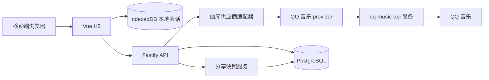

# 歌手歌曲个人排名 H5 技术方案

| 项目 | 内容 |
| --- | --- |
| 版本 | V0.1 初稿 |
| 日期 | 2026-10-02 |
| 关联产品文档 | [PRD.md](./PRD.md) |
| 文档状态 | 技术评审中 |

## 1. 技术目标与约束

- 支持移动端 H5，无账号即可搜索、比较、暂停、恢复和生成个人榜单。
- 未分享的逐轮选择和排名状态默认留在用户浏览器；仅在用户确认分享后上传结果快照。
- 曲库接入层隔离供应商协议。当前生产 provider 使用 QQ 音乐 API 服务；正式环境需保留来源、数据使用权限和内容质量审查。
- MVP 采用易部署的模块化单体，不引入微服务、Redis 或消息队列；流量和供应方要求证明必要性后再增加基础设施。
- 仅使用有明确授权的数据和字段；供应商条款决定曲库缓存、展示和留存策略。

## 2. 推荐技术栈

| 层 | 选择 | 用途与理由 |
| --- | --- | --- |
| 前端 | Vue 3、TypeScript、Vite、Vue Router、Pinia | 适合移动 H5；页面和本地会话状态清晰分层。 |
| UI 与样式 | CSS Modules 或 scoped CSS；设计 token 用 CSS variables | 控制移动端布局和版本标签等组件样式，避免首版引入重型组件库。 |
| 本地存储 | IndexedDB，通过 Dexie 封装；LocalStorage 只存少量 UI 偏好 | 保存完整曲库快照、比较事件和模型状态，支持版本迁移及较大曲库。 |
| 前端测试 | Vitest、Vue Testing Library、Playwright | 覆盖纯逻辑、关键组件与完整移动端流程。 |
| 后端 | Node.js LTS、TypeScript、Fastify、Zod | 以单一 API 服务实现曲库适配、反馈和分享；Zod 校验请求与供应商响应。 |
| 曲库适配 | QQ 音乐 API（由 qq-music-api 项目封装） | 搜索歌手并分页读取歌曲资料；映射可用的专辑、发行日期和封面信息，不返回音源。 |
| 数据库 | PostgreSQL、Drizzle ORM | 存储经授权允许缓存的目录映射、曲库反馈和分享快照；便于事务与 TTL 清理。 |
| API 文档 | OpenAPI 3，由 Fastify schema 生成或同步维护 | 让前后端接口和供应商适配契约可审阅、可测试。 |
| 部署 | 静态前端 CDN + 一个 Node API 服务 + 托管 PostgreSQL | 降低首版运维；具体云厂商、部署区域和备案要求在上线前按目标用户与授权合同确定。 |
| 质量与监控 | ESLint、Prettier、GitHub Actions；Sentry（脱敏错误）及隐私最小化产品事件 | 自动化检查、错误追踪和 PRD 漏斗统计；不得记录逐轮选择内容到第三方分析服务。 |

依赖版本在项目启动时锁定 Node.js LTS 和稳定版依赖，并使用 pnpm lockfile 固定可复现构建。若仓库后续已有技术选型，应优先按仓库标准调整上述建议。

## 3. 系统结构



### 3.1 数据流

1. H5 通过后端 API 搜索艺人、获取曲库元数据。后端负责 QQ 音乐 API 协议转换、超时、缓存和限流处理，不返回音频或音源地址。
2. 用户确认曲库后，H5 保存曲库版本快照；逐轮比较事件、Plackett–Luce 状态和暂停进度写入 IndexedDB，不上传到后端。
3. H5 排名模块生成当前完整榜单。用户提前结束或达到校准条件时仍能看到全部曲目，并区分暂定条目。
4. 用户主动分享并确认后，H5 将必要的只读榜单快照提交 API。服务端返回分享 URL 和用于撤销的随机凭据；凭据只保存在创建分享的本地浏览器。
5. 访问分享 URL 时，API 只返回公开快照；撤销或过期后返回不可访问状态。

## 4. 模块边界

### 4.1 Web 应用

- `artist-search`：搜索、同名艺人消歧、加载/错误状态。
- `catalog-review`：曲库预览、版本筛选、来源显示和问题反馈。
- `ranking-session`：首轮覆盖、多首选择、跳过、暂停/恢复和进度展示。
- `ranking-engine`：Plackett–Luce 多项选择估分、置信度估算、下一组调度及复活挑战；使用纯 TypeScript，不依赖 Vue。
- `results`：完整排序、暂定提示、继续校准和分享确认。
- `share-view`：只读公开榜单，不加载或读取本地排名会话。
- `local-session-store`：IndexedDB schema、自动保存、迁移和损坏恢复。

### 4.2 API 服务

- `catalog`：供应商适配器、响应校验、规范化、来源追踪和可授权的缓存策略。
- `catalog-issues`：缺歌、重复、误归属反馈；写入待处理记录，不直接改公共曲库。
- `shares`：快照创建、只读读取、撤销和过期清理。
- `health`：存活、就绪、数据库连接和供应商依赖状态。

API 服务使用模块化单体部署，模块之间只通过内部服务接口交互。排名算法留在 Web 端，API 不接收个人逐轮选择。

## 5. 排名引擎设计

### 5.1 模型输入与得分

每条有效比较记录包含候选歌曲 ID 集合和用户选中的歌曲 ID。对一组歌曲中选出最喜欢的一首，可按 Plackett–Luce 顶部选择似然建模：每首歌维护一个相对偏好参数，选择概率由其参数在当前候选组中的相对权重决定。模型参数只描述本次用户会话内的相对偏好。

用带轻微正则项的最大似然估计更新歌曲分数；不熟悉整组的跳过事件不进入似然。未比较歌曲使用中性初始值，并带高不确定度。排名分数、展示次数、选择次数和不确定度均由确定性的纯函数计算，输入相同事件必须得到相同结果。

### 5.2 下一组调度

- 首轮先构造覆盖式分组，使每首入选曲目至少展示一次；打散初始顺序，避免固定热门歌曲总先出现。
- 首轮后综合不确定度、相邻名次分数间隔和展示次数选择候选歌曲；候选组仍为 4–6 首，曲库规模不足时缩小组别。
- 复活挑战将高不确定度或边界附近的歌曲与略高排名歌曲重新同组比较；不设永久淘汰状态。
- 跳过组不更新分数，并以冷却策略避免刚跳过的完全相同组合立刻重现。
- 校准预算和完成阈值配置化；具体默认值通过模拟与试点数据确定，不写死为公平保证。

### 5.3 算法验证

- 用合成偏好数据生成 10、50、200、500 首曲库和不同偏好强度的用户，检查首轮覆盖、排名恢复率、轮次和计算耗时。
- 对比不同候选分组策略，观察真实排序与估计排序的 Kendall tau/Spearman 相关性，以及复活挑战前后的边界稳定度。
- 固化确定性随机种子，覆盖平分、单曲库、极小曲库、持续跳过、全曲库已覆盖及会话恢复等场景。
- 在目标低端移动设备上检查 500 首曲库的更新耗时；模型优化不能阻塞比较页交互。

## 6. 曲库适配与数据模型

### 6.1 适配器契约

后端定义供应商无关的 `CatalogProvider` 接口：

```ts
interface CatalogProvider {
  searchArtists(query: string): Promise<ArtistCandidate[]>;
  getArtist(artistId: string): Promise<ArtistCandidate | null>;
  getArtistCatalog(artistId: string): Promise<CatalogTrack[]>;
}
```

每个适配器负责供应方调用、响应解析、字段规范化和来源追踪。当前契约未包含独立的外链查询或跨平台曲目映射；自动化测试使用固定 HTTP 响应验证 QQ provider 契约，固定响应仅用于测试，不作为运行时曲库，CI 不调用真实服务。

开发和生产环境均使用 QQ 音乐 provider，不提供演示曲库或自动数据源回退。未设置 `QQ_MUSIC_API_URL` 时，API 进程会启动 `@sansenjian/qq-music-api` 兼容服务并绑定回环地址，默认端口为 `3200`；设置该变量时则连接外部部署的兼容服务。艺人搜索调用 `/getSmartbox?key=`，选定歌手后调用 `/getSingerAlbum` 获取专辑类型，并通过 `/getSingerHotsong?singermid=&limit=&page=` 分页读取曲库；上游每页最多返回 60 首，provider 将请求上限设为 60 以避免分页跳项。歌曲专辑未出现在歌手专辑列表时，provider 补查 `/getAlbumInfo` 并缓存本次请求中的结果。只有专辑类型可确认属于录音室专辑、Single、EP、精选/合辑或原声带的歌曲才会进入曲库；现场、伴奏、混音、翻唱、试听等标记会排除歌曲，缺少足够版本资料的记录也会排除。QQ 数字 version 字段语义未公开且不同版本混用，不参与判断。曲目先按 QQ 歌曲 ID 去重，再按规范化歌名、署名艺人和时长合并重复发行，并保留所选记录的 QQ 歌曲 ID；重复项优先保留专辑信息更完整、发行日期更早的记录。provider 映射接口返回的歌手、专辑、发行日期及封面字段。开发与生产环境都由后端访问该服务，前端不直连第三方 API。该社区项目 README 标注仅供学习研究且不可商业使用；上线前需确认该限制及 QQ 音乐服务条款适用于具体部署。

曲目映射歌曲名、表演者、可选专辑名、发行日期和封面；provider 不返回音频、歌词或流媒体地址。QQ API 的覆盖率、归属和字段质量可能变化或不完整，需保留问题反馈与来源追溯。该 API 由社区项目封装，并非 QQ 音乐官方 API；正式部署前需评估上游服务条款、数据使用权限、请求频率、缓存和留存限制。

### 6.2 关键实体

- `Artist`：内部艺人 ID、规范名、候选艺人来源映射。
- `Track`：内部录音 ID、标题、署名艺人、专辑、发行日期、版本类型。
- `TrackSource`：供应商 ID、许可范围、最近同步时间及字段来源；当前 QQ 音乐 provider 不生成音频或流媒体地址。
- `CatalogIssue`：问题类型、曲目/艺人引用、用户补充说明、创建时间、处理状态。
- `ShareSnapshot`：不可猜测 ID、快照 JSON、创建时间、过期时间、撤销凭据哈希。

曲库数据是否落库、保存多久及保存哪些字段，必须由供应商合同控制。跨平台不确定匹配只创建待审核候选，不自动合并。曲库版本号或快照时间随 API 返回，便于本地会话恢复时检测目录变化。

## 7. API 契约草案

所有路径带 `/api/v1` 前缀；请求和响应经 schema 校验，错误返回稳定错误码及可展示消息，不透传供应商密钥或原始错误。

| 方法 | 路径 | 用途 | 访问策略 |
| --- | --- | --- | --- |
| GET | `/artists?query=` | 搜索艺人候选 | 公开读取；长度限制、限流、结果数上限 |
| GET | `/artists/{artistId}/catalog` | 读取授权曲库及版本标签 | 公开读取；分页、缓存遵守供应商策略 |
| POST | `/catalog-issues` | 提交曲库问题 | 匿名写入；字段/长度限制、限流 |
| POST | `/shares` | 创建只读快照 | 匿名写入；大小限制、限流、快照内容校验 |
| GET | `/shares/{shareId}` | 获取有效快照 | 公开只读；过期或撤销均返回 404/410 |
| DELETE | `/shares/{shareId}` | 撤销快照 | 要求创建时返回的撤销凭据；服务端只存凭据哈希 |
| GET | `/health/live`、`/health/ready` | 存活与就绪探针 | 运维读取；不包含密钥或用户数据 |

分享快照不包含逐轮选择事件。创建接口返回一次性撤销凭据，客户端保存凭据用于原设备撤销；若凭据丢失，首版不提供账号找回。

## 8. 本地会话与分享存储

IndexedDB 会话至少包含 `schemaVersion`、艺人 ID、曲库快照版本、入选曲目 ID、比较事件、算法版本、模型缓存、完成状态及最后更新时间。恢复时先迁移本地 schema，再检测曲库版本；若歌曲被供应商移除，保留其会话快照元数据并提示用户，而不是静默删除榜单条目。

分享记录使用 PostgreSQL 保存最小只读快照。分享 ID 使用密码学安全随机值，禁止顺序 ID；快照大小和曲目数设上限。默认过期时间按 PRD 的建议设为 90 天，可配置；定时任务清除到期数据。创建、读取和撤销接口均设置 IP/速率限制、请求大小限制和安全日志；分享响应设置 `noindex`，不写入搜索引擎索引。

## 9. 隐私、安全与可用性

- 全站 HTTPS；供应商凭据只存服务端密钥管理系统或部署环境密钥，不进入前端包和日志。
- 不使用用户账号、跨站追踪 ID 或逐轮选择上传；分析事件采用汇总指标，字段经隐私审查。
- 匿名写接口限流、输入校验，并监测异常快照创建；必要时可临时关闭分享写入而保留本地结果功能。
- 公开分享链接按“持有链接即可访问”设计；快照只读，可撤销，到期删除。
- 后端对供应商超时设置短超时和有限重试；供应商不可用时显示错误并保留搜索/本地会话，不回退到未授权来源。
- IndexedDB 写入失败时提示当前设备无法可靠保存进度，并允许继续当前会话；分享失败时保留本地榜单。
- API、数据库和供应商故障需区分就绪状态；不将第三方供应商瞬时故障误报为整个 H5 不可用。

## 10. 测试与交付流水线

- **单元测试**：排名模型、候选调度、去重候选生成、schema 校验、会话迁移、分享过期/撤销。
- **集成测试**：Fastify API + PostgreSQL；QQ provider 使用契约测试和固定响应，禁止在 CI 中调用真实接口。
- **端到端测试**：搜索、消歧、确认曲库、连续比较、跳过、暂停恢复、提前结束、分享、撤销和过期状态。
- **视觉与设备测试**：Playwright 覆盖窄屏/常见移动视口、中文长歌名、键盘和触控、网络失败与页面刷新。
- **CI**：安装锁文件依赖，执行格式/类型检查、单测、集成测试、构建；主分支部署预览环境，正式环境需供应商授权和数据策略审查通过。

## 11. 分模块开发计划

以下估算按 2 名前端、1 名后端、1 名 QA/产品协作的 MVP 小组计算，约 6–7 周工程周期；平台商务授权等待时间不计入。若单人开发，按依赖顺序执行，周期相应延长。

| 阶段/模块 | 预估 | 主要工作 | 前置/并行关系 | 交付与退出条件 |
| --- | --- | --- | --- | --- |
| 0. 曲库供应商可行性 | 1 周，商务可并行 | 验证 QQ 音乐 API 歌手搜索、歌手歌曲分页、署名/专辑/封面字段、可用性、数据权限和缓存条款 | 最先启动；结果是数据接入决策门 | 字段映射和服务条款通过评审；覆盖不足时明确缺歌反馈和发布限制 |
| 1. 工程基础与接口契约 | 0.5 周 | 初始化 pnpm workspace、前后端、CI、环境配置、OpenAPI、错误格式、日志与数据库迁移 | 可与阶段 0 并行 | 本地/CI 可构建；API schema 和固定响应契约测试可运行 |
| 2. 曲库与艺人模块 | 1–1.5 周 | QQ provider、艺人搜索消歧、录音/发行关联、曲目规范化、来源追踪、版本筛选和错误反馈 | 依赖阶段 0/1；页面通过 QQ API 联调 | 契约测试通过；同名艺人可区分；不确定重复不会自动合并 |
| 3. 排名引擎与本地会话 | 1.5–2 周 | PL top-choice 估分、首轮覆盖、置信度、复活调度、IndexedDB 保存/迁移和恢复 | 可与阶段 2 并行；算法测试使用合成比较记录 | 算法模拟达到试点前质量门槛；刷新/恢复不丢失选择；跳过不污染分数 |
| 4. H5 主流程与结果页 | 1.5 周 | 搜索、曲库确认、比较卡片、进度、暂停恢复、完整结果、暂定状态、继续校准 | 依赖 UI/API 契约；与后端阶段 2/5 并行 | 移动端端到端主流程完成；曲库失败和空状态可理解 |
| 5. 分享与隐私控制 | 0.5–1 周 | 快照 schema、创建/读取/撤销、随机链接、90 天清理、分享确认与错误恢复 | 依赖阶段 1、结果模型；可与阶段 4 并行 | 未主动分享不产生上传；撤销/过期不可访问；失败不丢本地榜单 |
| 6. QA、试点与上线准备 | 1 周 | 全链路测试、移动设备检查、模型参数试点、授权复核、隐私与删除检查、监控和告警 | 依赖阶段 2–5 | PRD Must 验收通过；供应商授权和数据留存门槛通过；已知限制写入发布说明 |

### 11.1 建议迭代顺序

1. 第 1 周启动曲库授权可行性，同时搭建工程基础和 QQ API 契约测试。
2. 第 2–3 周并行完成曲库适配、排名引擎和本地会话；排名算法用合成比较记录验证长曲库耗时与排序恢复率，不生成运行时演示曲库。
3. 第 3–5 周完成 H5 主流程及结果体验；分享 API 与结果页并行实现。
4. 第 6 周执行集成和移动端 QA；依据小规模试点确定校准预算及结果文案。
5. 第 7 周作为授权、部署、隐私与上线缓冲；供应商合同未确认时不接入真实数据、不开放正式流量。

## 12. 技术风险与决策门

| 风险/决策 | 处理方式 | 决策时间 |
| --- | --- | --- |
| 社区维护的 QQ 音乐 API 不可用、上游变更或数据权限不满足产品目标 | 保持 provider 可替换；评审通过前限制正式流量，必要时缩小支持范围 | 工程开始第 1 周 |
| 供应商条款限制缓存、字段展示或快照留存 | 按条款缩短/关闭目录缓存；分享只保存允许的元数据或暂停分享 | 数据建模前及上线前 |
| 自适应模型估分或置信度不可解释 | 使用模拟数据和小规模试点校准；结果显示暂定状态，保留算法版本 | 完成排名引擎后、公开试点前 |
| 匿名分享被滥用 | 限流、大小限制、90 天过期、可撤销；异常时关闭分享写入 | 分享模块验收时 |
| 更换部署区域需备案或供应商限定地域 | 选定目标用户及数据供应合同后确定云区域和域名合规要求 | 部署预览环境前 |

## 13. 上线门槛

- 官方/合规数据来源通过授权、字段、覆盖、费用、限流和数据留存审核。
- 排名模拟覆盖小、中、大曲库；500 首参考曲库在目标移动设备上比较页无明显卡顿。
- 所有 Must 验收和关键端到端测试通过；分享创建、撤销、过期均有自动化测试。
- 服务端无供应商密钥泄漏；未分享会话不上传；分享快照可撤销、到期清理。
- 完成隐私文案、数据保留策略、监控告警和供应商故障降级演练。
